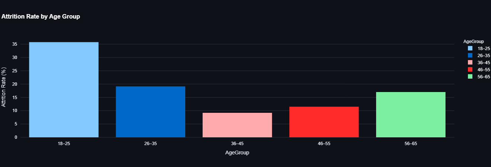
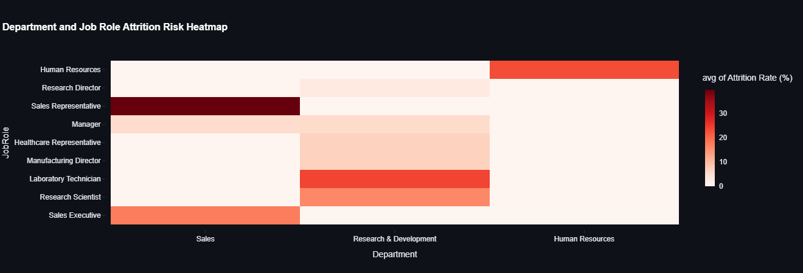
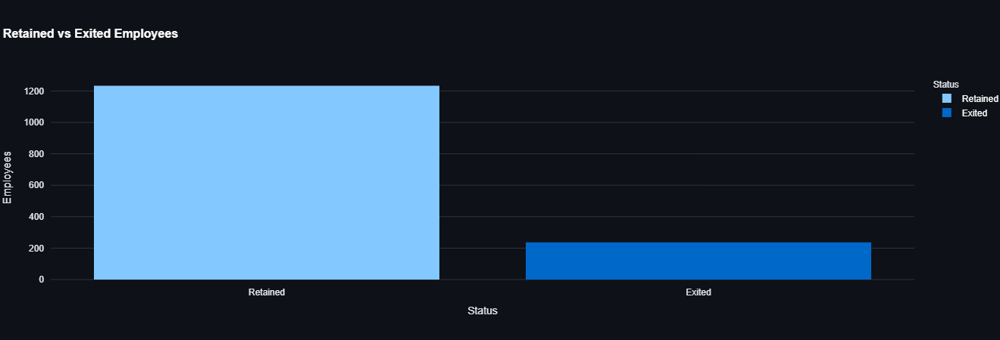
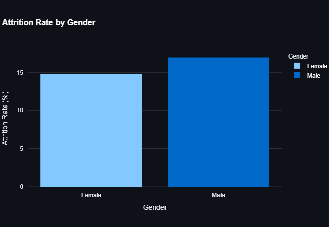
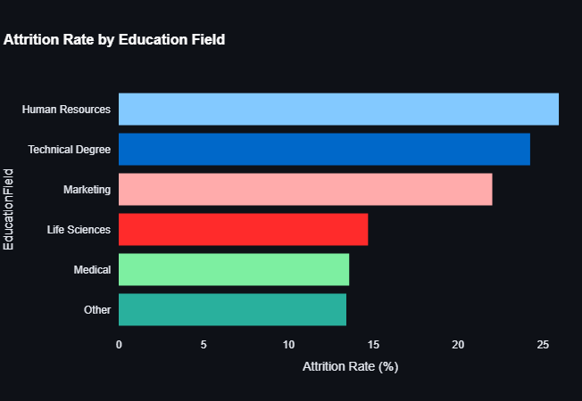
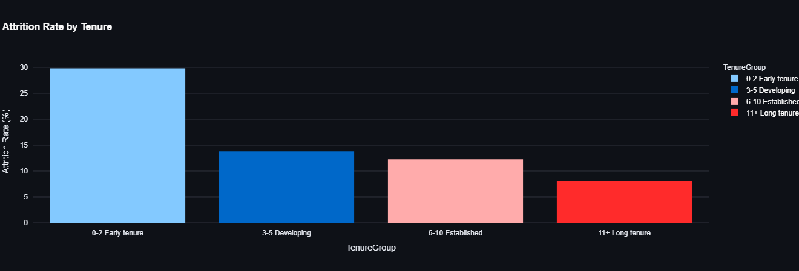
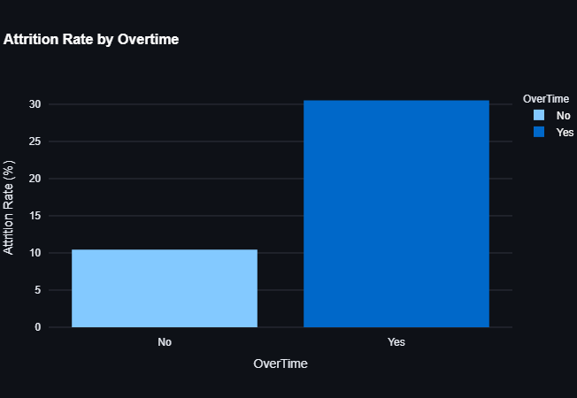
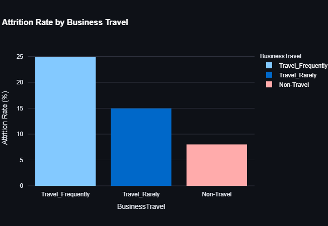
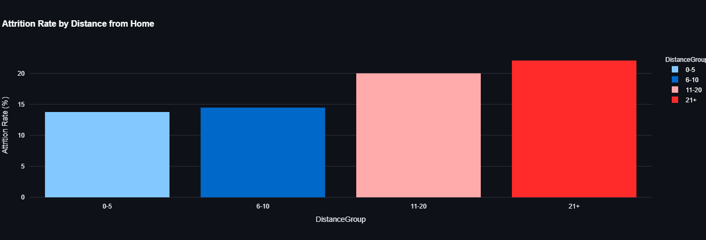

# Workforce Attrition Patterns and Risk Hotspot Analysis

## 📌 Project Overview

Employee attrition can affect workforce stability, knowledge retention, operational continuity, and workforce planning. This project analyzes employee attrition patterns to identify workforce segments with comparatively higher observed attrition rates and highlight areas that may require further investigation.

The project uses a dataset containing **1,470 employee records and 31 variables** covering demographic, organizational, employment, workload, travel, and commuting characteristics.

The analysis follows a **diagnostic analytics approach** rather than predicting individual employee departures. It focuses on understanding where attrition is concentrated across different workforce segments.

An interactive **Streamlit dashboard** was developed to allow users to explore these patterns dynamically using multiple workforce filters.

---

## 🎯 Objectives

The project aims to:

- Measure the overall employee attrition rate.
- Compare retained and exited employees.
- Identify departments and job roles with higher observed attrition.
- Analyze attrition across demographic groups.
- Examine attrition patterns across employee tenure.
- Investigate the relationship between overtime and attrition.
- Analyze business travel and commuting-distance patterns.
- Identify workforce attrition hotspots.
- Provide an interactive dashboard for stakeholder-level exploration.
- Translate analytical findings into actionable areas for further investigation.

---

## 📊 Key Findings

The analysis identified several notable attrition patterns.

| Workforce Dimension | Key Finding |
|---|---:|
| **Overall Attrition** | **16.12%** |
| **Employees Exited** | **237** |
| **Employees Retained** | **1,233** |
| **Highest Department Attrition** | Sales — **20.63%** |
| **Highest Job Role Attrition** | Sales Representative — **39.76%** |
| **Highest Age Group Attrition** | 18–25 — **35.77%** |
| **Highest Early-Tenure Attrition** | 0–2 years — **29.82%** |
| **Overtime: Yes** | **30.53%** |
| **Overtime: No** | **10.44%** |
| **Frequent Business Travel** | **24.91%** |
| **Non-Travel** | **8.00%** |
| **Distance 21+** | **22.06%** |
| **Distance 0–5** | **13.77%** |

### Major Observations

- Attrition was not evenly distributed across the workforce.
- **Sales Representatives** showed a notably high observed attrition rate.
- Employees in the **0–2 year tenure group** showed substantially higher attrition than longer-tenured employees.
- Employees working **overtime** showed considerably higher observed attrition than employees who did not.
- Younger employees, particularly those aged **18–25**, showed higher observed attrition.
- Attrition increased across the larger **distance-from-home** categories.
- Frequent business travellers showed higher observed attrition than non-travelling employees.

These findings are **descriptive and do not establish causal relationships**.

---

## 🔍 Analysis Areas

The exploratory analysis covers:

### Organizational Analysis
- Department-level attrition
- Job-role attrition
- Department and job-role hotspots

### Demographic Analysis
- Age groups
- Gender
- Education field

### Tenure Analysis
- 0–2 years
- 3–5 years
- 6–10 years
- 11+ years

### Workload Analysis
- Overtime vs. non-overtime employees

### Travel Analysis
- Frequent business travel
- Rare business travel
- Non-travel

### Commuting Analysis
- 0–5 distance group
- 6–10 distance group
- 11–20 distance group
- 21+ distance group

---

## 📈 Interactive Dashboard

The project includes an interactive **Streamlit dashboard** built using Python, Pandas, and Plotly.

### Dashboard Features

- Overall employee count
- Exited employee count
- Overall attrition rate
- Retained vs. exited employee visualization
- Department and job-role hotspot analysis
- Age-group analysis
- Gender analysis
- Education-field analysis
- Tenure analysis
- Overtime analysis
- Business-travel analysis
- Distance-from-home analysis
- Filtered employee data

### Interactive Filters

Users can dynamically filter the dashboard by:

- Department
- Job Role
- Tenure Range
- Overtime
- Business Travel

All dashboard metrics and visualizations update based on the selected filters.

---

## 🖼️ Dashboard Visualizations

### Attrition by Age Group



### Department and Job Role Hotspots



### Retained vs Exited Employees



### Attrition by Gender



### Attrition by Education Field



### Attrition by Tenure



### Attrition by Overtime



### Attrition by Business Travel



### Attrition by Distance from Home



---

## 🛠️ Tech Stack

### Programming & Analysis
- Python
- Pandas
- NumPy

### Data Visualization
- Plotly
- Matplotlib
- Seaborn

### Dashboard
- Streamlit

### Development & Documentation
- Jupyter Notebook
- Visual Studio Code
- LaTeX / IEEE format
- Git & GitHub

---

## 📁 Project Structure

```text
workforce-attrition-risk-analysis/
│
├── data/
│   └── Palo Alto Networks.csv
│
├── executive-summary/
│   └── executive summary.pdf
│
├── figures/
│   ├── attrition-rate-by-age-group.png
│   ├── attrition-rate-by-business-travel.png
│   ├── attrition-rate-by-distance-from-home.png
│   ├── attrition-rate-by-education-field.png
│   ├── attrition-rate-by-gender.png
│   ├── attrition-rate-by-overtime.png
│   ├── attrition-rate-by-tenure.png
│   ├── department-and-job-role-attrition-risk-h.png
│   └── retained-vs-exited-employees.png
│
├── python/
│   ├── app.py
│   └── attrition_analysis.ipynb
│
├── research-paper/
│   └── project1research paper.pdf
│
├── .gitignore
└── README.md
